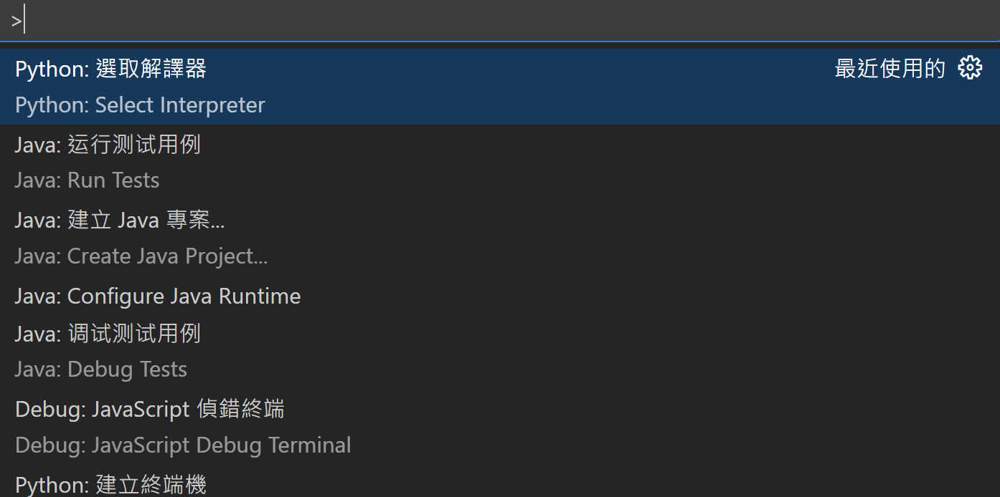
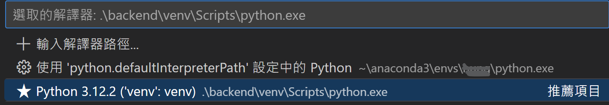

# How to use

創建python 虛擬環境  

`python -m venv venv`

啟動虛擬環境(windows)  

`.\venv\Scripts\activate`

ctrl + shift + p  
      
    
選擇python 解譯器(VScode)  
    

安裝依賴
`pip install -r .\requirements.txt` or
`pip3 install -r .\requirements.txt`

啟用後端

`python app.py or  python3 app.py`


.env.example 按照指示修改至.env

## API使用教學

### 登入

輸入：


`[POST] http://127.0.0.1:8000/users/login`  

```
{
    "email": "test@example.com",
    "password": "password123"
}
```

回傳：
- code 200

    ```
    {
        "body": {
            "birthday": "",
            "email": "test@example.com",
            "gender": "",
            "info": "",
            "password": "YOUR_PASSWORD_AFTER_HASHED",
            "phone": "",
            "username": "YOUR_USER_NAME"
        },
        "code": 200,
        "message": "登入成功"
    }
    ```
- code 400
    ```
    {
        "code": 400,
        "message": "電子郵件、名稱、密碼不得為空",
        "body": {}
    }
    ```
- code 401
    ``` 
    {
        "code": 401,
        "message": "帳號/密碼錯誤",
        "body": {}
    }
    ```
- code 404
    ```
    {
        "code": 404,
        "message": "帳戶不存在",
        "body": {}
    }
    ```
- code 500
    ```
    {
        "code": 500,
        "message": "Server Error",
        "body": {}
    }
    ```
### 註冊

輸入：


`[POST] http://127.0.0.1:8000/users/register`  

```
{
    "email": "test@example.com",
    "username": "testuser",
    "password": "password123"
}
```

回傳：
- code 201
    ```
    {
        "code": 201,
        "message": "註冊成功",
        "body": {}
    }
    ```
- code 400
    ```
    {
        "code": 400,
        "message": "電子郵件、名稱、密碼不得為空" | "電子郵件格式不正確",
        "body": {}
    }
    ```
- code 409
    ```
    {
        "code": 409,
        "message": "此電子郵件已經註冊過",
        "body": {}
    }
    ```
- code 500
    ```
    {
        "code": 500,
        "message": "Server Error",
        "body": {}
    }
    ```

### 新增書籍

輸入：

`[POST] http://127.0.0.1:8000/products//AddProducts`
```
{
    "name": "書本名稱",
    "language": "繁體中文",
    "category": "文學",
    "condiction": "二手",
    "author": "作者",
    "publisher": "出版社",
    "publishDate": "1945-01-01",
    "ISBN": 1234567890123,
    "price": 300,
    "description":"這是一本書",
    "photouri":"mple.com/image.jpg"
}
```

回傳：
- code 201
    ```
    {
        "body": {},
        "code": 201,
        "message": "商品新增成功"
    }
    ```
- code 400
    ```
    {
        "body": {},
        "code": 400,
        "message": "商品資料是空的" | "商品資料不能包含空值"
    }
    ```
- code 500 (${error}視情況而定)
    ```
    {
        "body": {},
        "code": 500,
        "message":"Sever Error(product_service.py): ${error}"
    }
    ```
### 查詢所有書籍

輸入：

`[GET] http://127.0.0.1:8000/products/GetAllProducts`

回傳：

- code 200
    ```
    {
        "body": [
            {
                "ISBN": 1234567890123,
                "author": "張三",
                "category": "程式設計",
                "condiction": "全新",
                "description": "一本適合初學者的 Python 書籍",
                "language": "中文",
                "name": "Java 放棄書籍",
                "photouri": "https://example.com/book.jpg",
                "price": 500,
                "publishDate": "Mon, 01 Jan 2024 00:00:00 GMT",
                "publisher": "ABC 出版社"
            },
            {
                "ISBN": 1234567890123,
                "author": "作者",
                "category": "文學",
                "condiction": "二手",
                "description": "這是一本書",
                "language": "繁體中文",
                "name": "書本名稱",
                "photouri": "mple.com/image.jpg",
                "price": 300,
                "publishDate": "1945-01-01",
                "publisher": "出版社"
            }
        ],
        "code": 200,
        "message": "成功取得所有商品"
    }
    ```
- code 500 (${error}視情況而定)
    ```
    {
        "body": {},
        "code": 500,
        "message":"Sever Error(product_service.py): ${error}"
    }
    ```